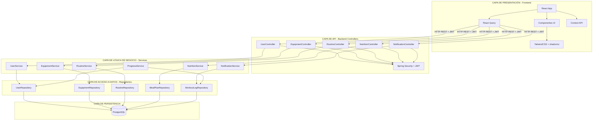
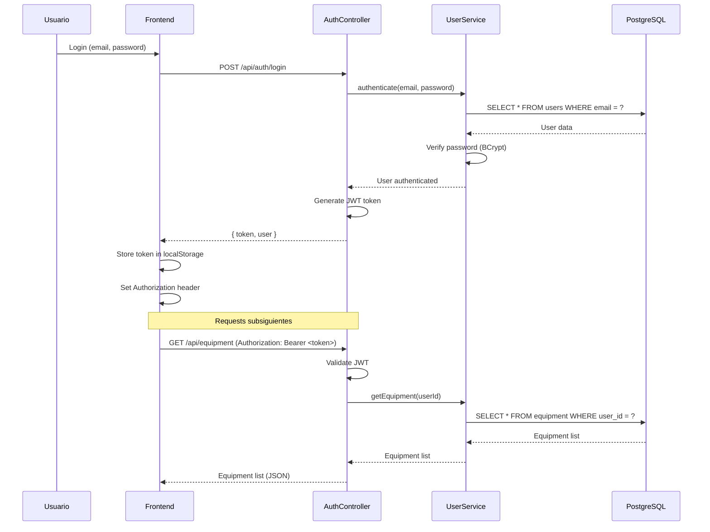

# Diagrama de Arquitectura - FitWell

## Arquitectura en N-Capas (Layered Architecture)

---

## 📊 Diagrama Completo del Sistema



---

## 🏗️ Descripción de Capas

### 1. Capa de Presentación (Frontend)

**Tecnologías:** React + TypeScript + TailwindCSS

**Responsabilidades:**

- Renderizar interfaz de usuario
- Capturar interacciones del usuario
- Gestionar estado local de UI
- Comunicarse con el backend vía API REST

**Componentes principales:**

- Componentes de UI (botones, formularios, cards)
- Páginas (Dashboard, Rutinas, Perfil, etc.)
- Hooks personalizados
- Context providers

---

### 2. Capa de API (Controllers)

**Tecnologías:** Spring Boot + Spring MVC

**Responsabilidades:**

- Exponer endpoints REST
- Validar entrada (DTOs)
- Autenticar y autorizar requests
- Serializar/deserializar JSON
- Manejar errores HTTP

**Endpoints principales:**

```
POST   /api/auth/register
POST   /api/auth/login
GET    /api/users/{id}
POST   /api/equipment
GET    /api/equipment
DELETE /api/equipment/{id}
GET    /api/routines
POST   /api/routines/{id}/activate
GET    /api/progress/stats
```

---

### 3. Capa de Lógica de Negocio (Services)

**Tecnologías:** Spring Boot + Spring Services

**Responsabilidades:**

- Implementar reglas de negocio
- Orquestar operaciones complejas
- Validar lógica de dominio
- Coordinar entre repositorios
- Aplicar principios SOLID

**Servicios principales:**

- `UserService`: Gestión de usuarios, cálculo de IMC
- `EquipmentService`: CRUD de equipamiento
- `RoutineService`: Creación y activación de rutinas
- `NutritionService`: Planes alimenticios
- `NotificationService`: Envío de notificaciones
- `ProgressService`: Cálculo de estadísticas

---

### 4. Capa de Acceso a Datos (Repositories)

**Tecnologías:** Spring Data JPA + Hibernate

**Responsabilidades:**

- Abstraer acceso a base de datos
- Ejecutar queries SQL
- Mapear entidades a tablas
- Gestionar transacciones

**Repositorios principales:**

```java
public interface UserRepository extends JpaRepository<User, Long> {
    Optional<User> findByEmail(String email);
}

public interface EquipmentRepository extends JpaRepository<Equipment, Long> {
    List<Equipment> findByUserId(Long userId);
}

public interface RoutineRepository extends JpaRepository<Routine, Long> {
    List<Routine> findByActiveTrue();
}
```

---

### 5. Capa de Persistencia (Base de Datos)

**Tecnología:** PostgreSQL

**Responsabilidades:**

- Almacenar datos persistentes
- Garantizar integridad referencial
- Optimizar queries con índices
- Gestionar transacciones ACID

**Tablas principales:**

- `users`: Datos de usuarios
- `equipment`: Equipamiento disponible
- `routines`: Rutinas de entrenamiento
- `exercises`: Catálogo de ejercicios
- `meal_plans`: Planes alimenticios
- `workout_logs`: Registro de entrenamientos
- `notifications`: Notificaciones configuradas

---

## 🔄 Flujo de Datos Típico

### Ejemplo: Agregar Equipamiento

```
1. Usuario hace click en "Agregar Equipo" (Frontend)
   ↓
2. React captura evento y llama a API
   ↓
3. POST /api/equipment con { nombre: "Mancuernas", tipo: "PESO_LIBRE" }
   ↓
4. EquipmentController recibe request
   ↓
5. Spring Security valida JWT
   ↓
6. Controller valida DTO
   ↓
7. Controller llama a EquipmentService.addEquipment()
   ↓
8. Service crea entidad Equipment
   ↓
9. Service llama a EquipmentRepository.save()
   ↓
10. Repository ejecuta INSERT en PostgreSQL
   ↓
11. PostgreSQL retorna ID generado
   ↓
12. Repository retorna Equipment con ID
   ↓
13. Service retorna Equipment
   ↓
14. Controller serializa a JSON
   ↓
15. HTTP 201 Created con Equipment en body
   ↓
16. React Query actualiza caché
   ↓
17. UI se actualiza automáticamente
```

---

## 🔐 Seguridad

### Autenticación y Autorización



---

## 📦 Estructura de Proyecto

### Backend (Spring Boot)

```
src/main/java/com/fitwell/
├── FitwellApplication.java
├── config/
│   ├── SecurityConfig.java
│   └── CorsConfig.java
├── controllers/
│   ├── AuthController.java
│   ├── UserController.java
│   ├── EquipmentController.java
│   └── RoutineController.java
├── services/
│   ├── UserService.java
│   ├── EquipmentService.java
│   └── RoutineService.java
├── repositories/
│   ├── UserRepository.java
│   ├── EquipmentRepository.java
│   └── RoutineRepository.java
├── entities/
│   ├── User.java
│   ├── Equipment.java
│   └── Routine.java
├── dto/
│   ├── LoginRequest.java
│   ├── EquipmentDTO.java
│   └── RoutineDTO.java
└── security/
    ├── JwtTokenProvider.java
    └── JwtAuthenticationFilter.java
```

### Frontend (React)

```
src/
├── App.tsx
├── main.tsx
├── components/
│   ├── ui/
│   │   ├── Button.tsx
│   │   ├── Card.tsx
│   │   └── Input.tsx
│   ├── layout/
│   │   ├── Header.tsx
│   │   └── Sidebar.tsx
│   └── features/
│       ├── equipment/
│       │   ├── EquipmentList.tsx
│       │   └── AddEquipmentForm.tsx
│       └── routines/
│           ├── RoutineList.tsx
│           └── RoutineCard.tsx
├── pages/
│   ├── Dashboard.tsx
│   ├── Equipment.tsx
│   ├── Routines.tsx
│   └── Profile.tsx
├── hooks/
│   ├── useAuth.ts
│   ├── useEquipment.ts
│   └── useRoutines.ts
├── services/
│   ├── api.ts
│   ├── authService.ts
│   └── equipmentService.ts
└── context/
    └── AuthContext.tsx
```

---

## 🚀 Ventajas de Esta Arquitectura para FitWell

1. **Separación Clara**: Cada capa tiene responsabilidades bien definidas
2. **Testeable**: Fácil hacer unit tests de cada capa
3. **Mantenible**: Cambios en una capa no afectan otras
4. **Escalable**: Podemos optimizar cada capa independientemente
5. **Familiar**: Patrón estándar en Spring Boot y React

---

## 📈 Evolución Futura

Si FitWell crece, podemos evolucionar a:

1. **Caché**: Agregar Redis entre Service y Repository
2. **CDN**: Para assets estáticos del frontend
3. **Load Balancer**: Para múltiples instancias del backend
4. **Microservicios**: Separar servicios grandes (Notificaciones, Nutrición)
5. **Event-Driven**: Usar mensajería (RabbitMQ/Kafka) para operaciones asíncronas

---

**Autor:** David  
**Fecha:** Febrero 2026
