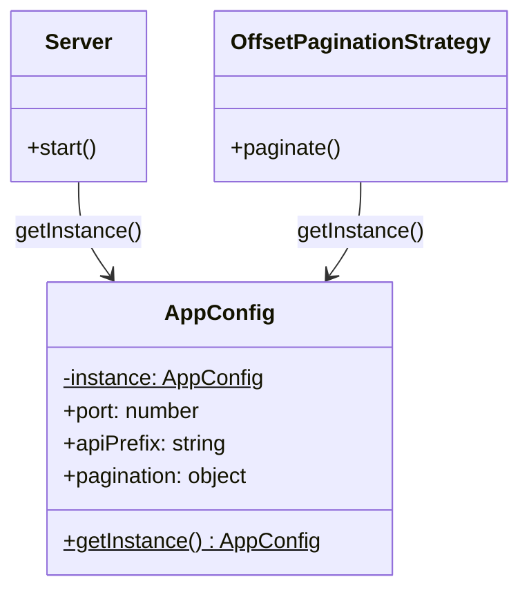
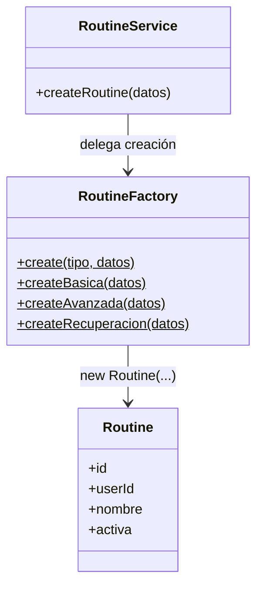
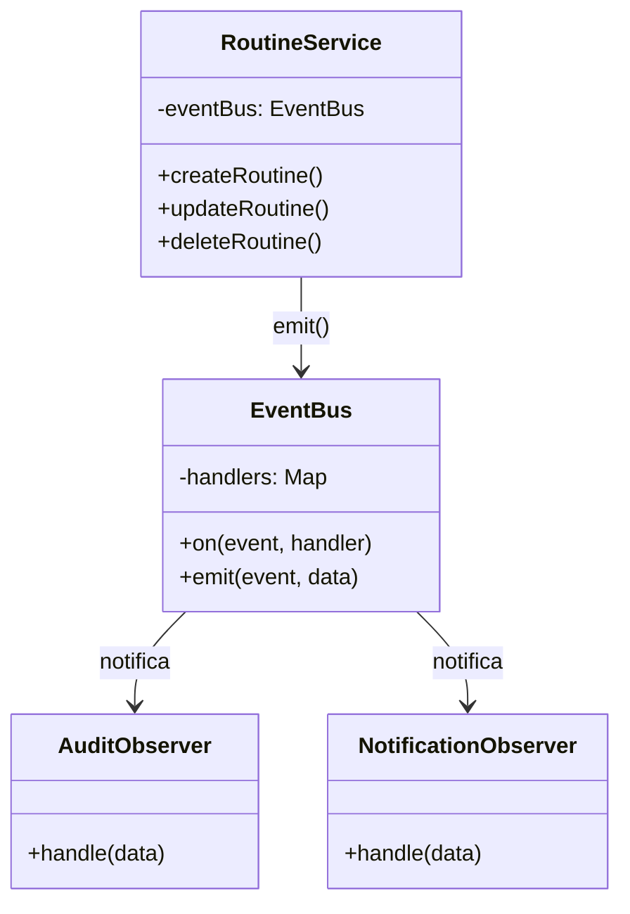
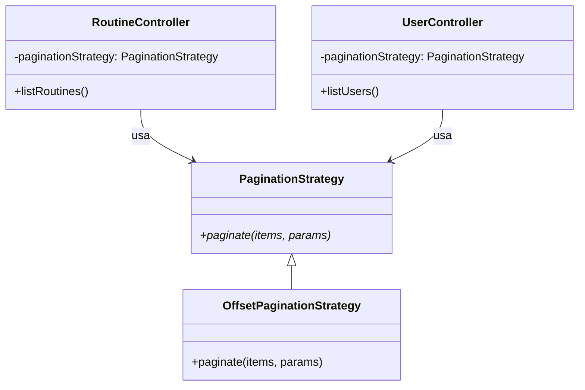
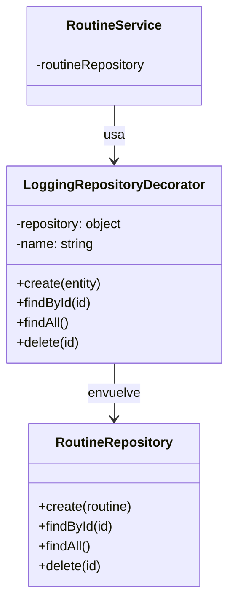

# Patrones de Diseño Aplicados — FitWell Semana 05

**Dominio:** Sistema de seguimiento de ejercicios (FitWell)  
**Base:** API REST de semana 04 (Users + Routines)  
**Patrones implementados:** 5 (1 creacional, 1 creacional, 1 estructural, 1 comportamiento, 1 comportamiento)

---

## ¿Qué es un patrón de diseño?

Un patrón de diseño es una solución probada a un problema recurrente en el desarrollo de software.
No es código que copias — es una idea que adaptas a tu contexto.
Los patrones tienen nombre porque los problemas que resuelven aparecen una y otra vez en proyectos reales.

---

## Patrón 1: Singleton (Creacional)

### El problema que existía

En la semana 04, el puerto `3000`, los límites de paginación `10`, y la versión de la API `v1`
estaban escritos directamente en el código de varios archivos:

```js
// ❌ ANTES — semana 04
// En server.js:
const PORT = 3000;

// En RoutineController.js:
const page = Math.max(1, parseInt(req.query.page ?? "1", 10));
const limit = Math.max(1, parseInt(req.query.limit ?? "10", 10));

// En UserController.js:
const page = Math.max(1, parseInt(req.query.page ?? "1", 10));
const limit = Math.max(1, parseInt(req.query.limit ?? "10", 10));
```

Si querías cambiar el límite por defecto de 10 a 20, tenías que buscarlo en múltiples archivos.
Si querías cambiar el puerto, igual. Esto se llama **"magic numbers"** — valores sin nombre ni contexto.

### La solución: Singleton

Una clase `AppConfig` que:

1. Solo puede tener **una instancia** en toda la aplicación
2. Es accesible desde cualquier archivo con `AppConfig.getInstance()`
3. Centraliza toda la configuración en un solo lugar

```js
// ✅ DESPUÉS — semana 05
// src/patterns/singleton/AppConfig.js

export class AppConfig {
  static #instance = null; // La instancia única, guardada aquí

  constructor() {
    this.port = 3000;
    this.apiVersion = "v1";
    this.apiPrefix = `/api/${this.apiVersion}`;
    this.pagination = {
      defaultPage: 1,
      defaultLimit: 10,
      maxLimit: 100,
    };
  }

  static getInstance() {
    if (!AppConfig.#instance) {
      AppConfig.#instance = new AppConfig(); // Solo se crea UNA vez
    }
    return AppConfig.#instance; // Siempre devuelve la misma
  }
}

// Uso en cualquier archivo:
const config = AppConfig.getInstance();
console.log(config.port); // 3000
console.log(config.apiPrefix); // /api/v1
```

### ¿Por qué funciona?

La primera vez que llamas `AppConfig.getInstance()`, crea el objeto y lo guarda en `#instance`.
La segunda, tercera, décima vez — devuelve el mismo objeto que ya existe.
Es como una variable global, pero controlada y con nombre.

### Principio SOLID reforzado

**DRY (Don't Repeat Yourself)** + **SRP**: la configuración tiene una sola responsabilidad
y un solo lugar donde vivir.

### Diagrama



### Beneficios obtenidos

- Cambias el puerto en un solo lugar y afecta todo el sistema
- Los límites de paginación son consistentes en todos los controladores
- Fácil de extender: agregar `this.debug = true` y está disponible en toda la app

---

## Patrón 2: Factory Method (Creacional)

### El problema que existía

En `RoutineService.createRoutine()`, la construcción del objeto `Routine` estaba
mezclada con validaciones y lógica de negocio:

```js
// ❌ ANTES — semana 04
createRoutine({ userId, nombre, descripcion = '', activa = false }) {
  this.assertUserExists(userId);
  // ... validaciones ...

  // La creación está aquí, mezclada con todo lo demás
  const routine = new Routine({
    id: null,
    userId,
    nombre: String(nombre).trim(),
    descripcion: String(descripcion ?? ''),
    activa,
  });

  return this.routineRepository.create(routine);
}
```

Si querías crear rutinas de distintos tipos (básica, avanzada, recuperación) con valores
por defecto diferentes, tendrías que agregar `if/else` dentro del servicio.
El servicio crecería y mezclaría responsabilidades.

### La solución: Factory Method

Una clase `RoutineFactory` que centraliza la creación de rutinas según su tipo:

```js
// ✅ DESPUÉS — semana 05
// src/patterns/factory/RoutineFactory.js

export class RoutineFactory {
  static createBasica({ userId, nombre, descripcion = "" }) {
    return new Routine({
      id: null,
      userId,
      nombre,
      descripcion: descripcion || "Rutina básica — peso corporal",
      activa: false,
    });
  }

  static createAvanzada({ userId, nombre, descripcion = "" }) {
    return new Routine({
      id: null,
      userId,
      nombre,
      descripcion: descripcion || "Rutina avanzada — requiere equipamiento",
      activa: false,
    });
  }

  static createRecuperacion({ userId, nombre }) {
    return new Routine({
      id: null,
      userId,
      nombre,
      descripcion: "Rutina de recuperación — movilidad y stretching",
      activa: true, // recuperación siempre arranca activa
    });
  }

  // Método genérico que decide según el tipo
  static create(tipo = "basica", datos) {
    switch (tipo) {
      case "avanzada":
        return RoutineFactory.createAvanzada(datos);
      case "recuperacion":
        return RoutineFactory.createRecuperacion(datos);
      default:
        return RoutineFactory.createBasica(datos);
    }
  }
}

// En RoutineService — ahora solo llama a la factory:
const routine = RoutineFactory.create(tipo, { userId, nombre, descripcion });
```

### ¿Por qué funciona?

El servicio ya no sabe cómo se construye una rutina — solo sabe que la factory se la entrega lista.
Si mañana agregas un tipo `'hiit'`, solo tocas `RoutineFactory` — el servicio no cambia.

Para probar con la API, agrega `"tipo": "avanzada"` en el body del POST:

```json
{
  "userId": 1,
  "nombre": "Mi rutina",
  "activa": false,
  "tipo": "avanzada"
}
```

### Principio SOLID reforzado

**OCP (Open/Closed)**: el servicio está cerrado a modificación pero abierto a extensión.
Nuevos tipos de rutina = solo tocar la factory.

### Diagrama



### Beneficios obtenidos

- Agregar un nuevo tipo de rutina no toca el servicio
- Los valores por defecto de cada tipo están en un solo lugar
- El código del servicio es más limpio y legible

---

## Patrón 3: Observer (Comportamiento)

### El problema que existía

Cuando se activaba una rutina en semana 04, solo pasaba una cosa: desactivar las demás.
Pero en una app real, al activar una rutina querrías también:

- Registrar en auditoría quién activó qué y cuándo
- Notificar al usuario en su teléfono
- Actualizar estadísticas
- Enviar un email

Sin Observer, tendrías que agregar todo eso dentro de `RoutineService`:

```js
// ❌ ANTES — cómo quedaría sin Observer
updateRoutine(id, updateData) {
  // ... lógica de negocio ...

  if (updateData.activa === true) {
    // Auditoría
    console.log('[AUDIT] rutina activada...');
    // Notificación
    notificationService.send(userId, 'Tu rutina está activa');
    // Estadísticas
    statsService.increment('routines_activated');
    // Email
    emailService.send(user.email, 'Rutina activada');
    // ... y lo que venga después
  }
}
```

Cada nueva reacción = modificar el servicio. Viola OCP.

### La solución: Observer con EventBus

```js
// ✅ DESPUÉS — semana 05

// EventBus: el "tablón de anuncios"
const eventBus = new EventBus();

// Suscribir observers (en server.js)
eventBus.on("routine.activated", (data) => auditObserver.handle(data));
eventBus.on("routine.activated", (data) => notificationObserver.handle(data));

// En RoutineService — solo emite el evento, no sabe quién escucha
if (updateData.activa === true) {
  this.eventBus.emit("routine.activated", {
    event: "routine.activated",
    payload: updated.toJSON(),
  });
}
```

Cuando activas una rutina, verás en consola:

```
[AUDIT] 2026-04-09T... | evento: routine.activated | datos: {...}
[NOTIF] 📱 Notificación → Usuario 1: Tu rutina "Rutina B" está activa. ¡A entrenar!
```

### ¿Por qué funciona?

El servicio emite un evento y se desentiende. No sabe cuántos observers hay ni qué hacen.
Para agregar un nuevo observer (ej: `StatsObserver`), solo lo suscribes en `server.js` — el servicio no cambia.

### Principio SOLID reforzado

**OCP**: el servicio está cerrado a modificación. Nuevas reacciones = nuevos observers.
**SRP**: cada observer tiene una sola responsabilidad (auditar, notificar, etc.).

### Diagrama



### Beneficios obtenidos

- Agregar un nuevo observer no toca el servicio
- Si un observer falla, el flujo principal no se rompe (try/catch en EventBus)
- Los eventos son reutilizables: `routine.created` puede tener 10 observers

---

## Patrón 4: Strategy (Comportamiento)

### El problema que existía

La lógica de paginación estaba duplicada en `RoutineController` y `UserController`:

```js
// ❌ ANTES — semana 04 (en RoutineController)
const page  = Math.max(1, parseInt(req.query.page  ?? '1',  10));
const limit = Math.max(1, parseInt(req.query.limit ?? '10', 10));
const routines = this.routineService.listRoutines(...).map(r => r.toJSON());
return sendPaginationResponse(res, routines, { page, limit });

// ❌ ANTES — semana 04 (en UserController) — MISMO CÓDIGO
const page  = Math.max(1, parseInt(req.query.page  ?? '1',  10));
const limit = Math.max(1, parseInt(req.query.limit ?? '10', 10));
const all = this.userService.listUsers().map(u => u.toJSON());
return sendPaginationResponse(res, all, { page, limit });
```

Si querías cambiar a cursor-based pagination, tenías que modificar ambos controladores.

### La solución: Strategy

```js
// ✅ DESPUÉS — semana 05

// Clase base (contrato)
export class PaginationStrategy {
  paginate(items, params) {
    throw new Error("Implementar en subclase");
  }
}

// Estrategia concreta
export class OffsetPaginationStrategy extends PaginationStrategy {
  paginate(items, params = {}) {
    const config = AppConfig.getInstance().pagination;
    const page = Math.max(1, parseInt(params.page ?? config.defaultPage, 10));
    const limit = Math.min(
      config.maxLimit,
      Math.max(1, parseInt(params.limit ?? config.defaultLimit, 10)),
    );
    // ... calcula y devuelve { data, meta }
  }
}

// En los controladores — usan la estrategia sin saber cómo funciona
const { data, meta } = this.paginationStrategy.paginate(items, req.query);
return sendSuccess(res, { data, meta });
```

Para cambiar a cursor-based pagination en el futuro:

```js
// Solo creas una nueva estrategia y la inyectas — los controladores no cambian
this.paginationStrategy = new CursorPaginationStrategy();
```

### Principio SOLID reforzado

**OCP**: los controladores no cambian cuando cambia el algoritmo de paginación.
**DIP**: los controladores dependen de la abstracción `PaginationStrategy`, no de la implementación concreta.

### Diagrama



### Beneficios obtenidos

- Cero duplicación de código de paginación
- Cambiar el algoritmo de paginación = crear una clase nueva, no modificar controladores
- Los límites vienen del Singleton (AppConfig) — consistencia total

---

## Patrón 5: Decorator (Estructural)

### El problema que existía

Para agregar logging a los repositorios (saber cuándo se guarda, busca o elimina algo),
la única opción era modificar `UserRepository` y `RoutineRepository` directamente:

```js
// ❌ ANTES — cómo quedaría sin Decorator
export class RoutineRepository {
  create(routine) {
    console.log("[LOG] Creando rutina..."); // ← mezclado con la lógica
    const id = this.nextId++;
    routine.id = id;
    this.routines.set(id, routine);
    console.log("[LOG] Rutina creada con id:", id); // ← mezclado
    return routine;
  }
  // ... y así en cada método
}
```

El repositorio mezcla dos responsabilidades: persistir datos Y loguear.
Si quieres quitar el logging en producción, tienes que modificar el repositorio.

### La solución: Decorator

```js
// ✅ DESPUÉS — semana 05
// El repositorio original NO se toca — sigue siendo puro

export class LoggingRepositoryDecorator {
  constructor(repository, name = "Repository") {
    this.repository = repository; // envuelve al repositorio real
    this.name = name;
  }

  create(entity) {
    console.log(`[${this.name}] create() →`, JSON.stringify(entity));
    const result = this.repository.create(entity); // delega al real
    console.log(`[${this.name}] create() ← id=${result.id}`);
    return result;
  }

  findById(id) {
    console.log(`[${this.name}] findById(${id})`);
    return this.repository.findById(id); // delega al real
  }
  // ... todos los métodos delegan y agregan logging
}

// En server.js — se activa simplemente envolviendo el repositorio:
const routineRepository = new LoggingRepositoryDecorator(
  new RoutineRepository(),
  "RoutineRepo",
);
// Para desactivar logging: solo usa new RoutineRepository() directamente
```

Cuando haces un POST a `/api/v1/routines`, verás en consola:

```
[RoutineRepo] create() → {"id":null,"userId":1,"nombre":"Rutina A",...}
[RoutineRepo] create() ← id=1
```

### Principio SOLID reforzado

**OCP**: el repositorio original está cerrado a modificación. El logging se agrega por extensión.
**SRP**: el repositorio solo persiste datos. El decorador solo loguea.

### Diagrama



### Beneficios obtenidos

- El repositorio original no se toca — sigue siendo limpio y testeable
- Activar/desactivar logging = cambiar una línea en server.js
- El mismo decorador funciona para UserRepository y RoutineRepository

---

## Cómo cooperan los 5 patrones

```
Request POST /api/v1/routines
        │
        ▼
RoutineController
  │  usa OffsetPaginationStrategy (STRATEGY)
        │
        ▼
RoutineService
  │  recibe eventBus por DIP
  │  llama RoutineFactory.create() (FACTORY METHOD)
  │  emite eventBus.emit('routine.created') (OBSERVER)
        │
        ├──► AuditObserver.handle()       → log de auditoría
        └──► NotificationObserver.handle() → notificación al usuario
        │
        ▼
LoggingRepositoryDecorator (DECORATOR)
  │  loguea la operación
        │
        ▼
RoutineRepository
  │  guarda en Map
        │
        ▼
AppConfig.getInstance() (SINGLETON)
  │  provee límites de paginación y configuración
```

Cada patrón resuelve un problema diferente, pero todos trabajan juntos en el mismo flujo.

---

## Cómo ejecutar

```bash
cd semanas/semana_5
npm install
npm run dev
```

Abre `http://localhost:3000` y verás los 5 patrones activos.

Para probar el Factory Method, agrega `"tipo"` en el body:

```json
{ "userId": 1, "nombre": "Mi rutina", "activa": false, "tipo": "avanzada" }
```

Tipos disponibles: `"basica"` (default), `"avanzada"`, `"recuperacion"`
